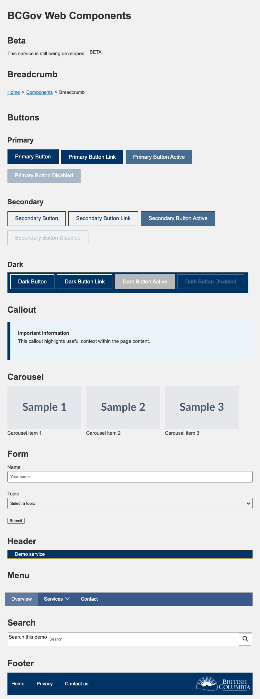

# BCGov Design System Web Components

## Install

```sh
npm i git+https://github.com/bcgov/design-system-web-components.git
```

## Use with module bundler (Webpack, React, Angular)

## Upgrading from v1.x

The current release is built with Stencil 4. Remove any site CSS that hides the page until the `html` element receives a `hydrated` class. Stencil applies hydration state to components, not to the page root.

```css
html {
  display: none;
  &.hydrated {
    display: block;
  }
}
```

## Import into package.json

```json
    "devDependencies": {
      "@bcgov/web-components": "github:bcgov/design-system-web-components#2.0.0",
      ....
    }
```

### Use with a module bundler

In the application entry point:

```javascript
import '@bcgov/web-components/dist/bcgov-web-components/bcgov-web-components.esm';
```

### Use with SCSS

Import the component styles from the application entry point:

```javascript
import "@bcgov/web-components/src/components/sass/style.scss";
```

The package also provides the standard Stencil loader and custom-elements output under `dist/loader` and `dist/components` for applications that do not use the bundled ESM entry point. See [Stencil's framework integration documentation](https://stenciljs.com/docs/overview) for framework-specific setup.


## Description

The BCGov Web components was created to give a standard look and feel to meet the criteria of the Design System  
Here is how it does it:

- Uses a technology called [Web Components](https://www.webcomponents.org/)
- Uses a compiler that generates Web Components called [StencilJS](https://stenciljs.com/)
- Uses [sass](https://sass-lang.com/) files
- Uses the Stencil CLI to build the package and run the local component demo.

## Accessibility

All components should meet or exceed [WCAG 2.0 AA](https://www.w3.org/TR/WCAG20/) standards Although this is the intention, this is very much a **work in progress**.

## Component demo

The demo shows the components currently available in this package:



- Beta: `<bcgov-beta>`
- Breadcrumb: `<bcgov-breadcrumb>`
- Button: `<bcgov-button>`
- Callout: `<bcgov-callout>`
- Carousel: `<bcgov-carousel>`
- Footer: `<bcgov-footer>`
- Form: `<bcgov-form>`
- Header: `<bcgov-header>`
- Menu: `<bcgov-menu>`
- Search: `<bcgov-search>`

## Development

Install dependencies and build the package with:

```sh
npm install
npm run build
```

### Component demo

Start the Stencil development server to view the demo page, which showcases all components:

```sh
npm start
```

Open [http://localhost:3333/](http://localhost:3333/) (or the URL printed in the terminal if the port differs). The demo page source is `src/index.html`.

Run the component tests with `npm test`.

The test suite includes unit tests and browser-based component tests. Install the Chromium browser used by the browser tests after installing dependencies:

```sh
npx playwright install chromium
```

Run tests once with:

```sh
npm test
```

Run tests in watch mode with:

```sh
npm run test:watch
```

## Migration Steps

For migrating existing Stencil 2 component tests to this repository's Stencil 4 test setup, follow the [Stencil 4 testing migration guide](docs/stencil-4-testing-migration.md). It includes the setup changes, recommended test patterns, and a reference component test suite.
